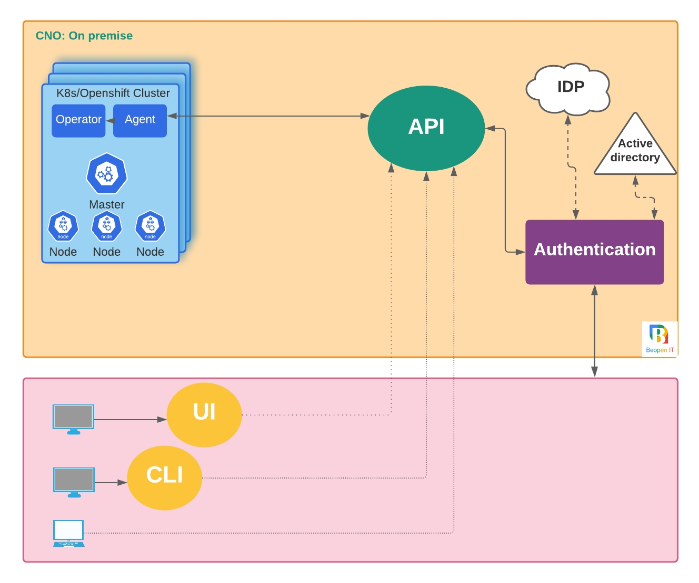

# CNO, Cloud Native Onboarding.
Onboard, Deploy, Manage and Secure microservices on Kubernetes.
CNO (Cloud Native Onboarding) is an open source platform to onboard easily and securely development teams on multi-cloud Kubernetes clusters from a single console.

* [Get Started](#Installation)
* [Architecture](#Architecture)
* [Component](#Component)
* [Installation](#Installation)
* [Contributing](#Contributing)
# Why CNO ?


# Architecture overview

## Components
CNO is an open source project mainly composed of 7 modules.
1. [cno UI](https://github.com/beopencloud/cno-ui-template)
2. [cno API](https://github.com/beopencloud/cno-api)
3. [cno Agent](https://github.com/beopencloud/cno-agent)
4. [cno Openshift-operator](https://github.com/beopencloud/cno-openshift-operator)
5. [cno CD-operator](https://github.com/beopencloud/cno-cd)
6. [cno K8s-operator](https://github.com/beopencloud/cno-kubernetes-operator)
7. [cno Notification](https://github.com/beopencloud/cno-notification)
7. [cno Client](https://github.com/beopencloud/cnoctl)
   
# Installation CNO via utility script with curl
## Installation
```bash
curl -sSL https://raw.githubusercontent.com/beopencloud/cno/main/scripts/install.sh | sh
```
## Uninstallation
 ```bash
curl -sSL https://raw.githubusercontent.com/beopencloud/cno/main/scripts/uninstall.sh | sh
```

## Contributing
To Contribute to the CNO project, please follow this [Contributor's Guide](https://github.com/beopencloud/cno/tree/main/contributor_guide)


