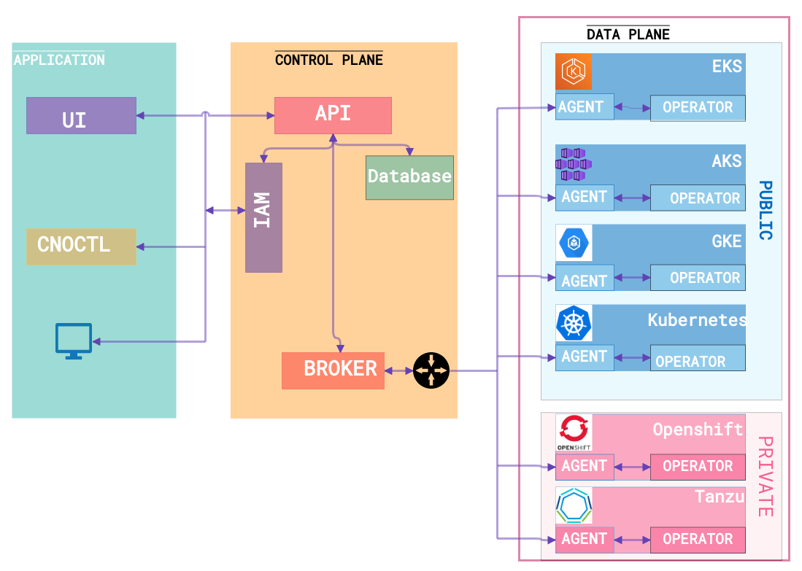

# CNO, Cloud Native Onboarding.
Onboard, Deploy, Manage and Secure microservices on Kubernetes.

CNO (Cloud Native Onboarding) is an open source platform to onboard easily and securely development teams on multi-cloud Kubernetes clusters from a single console.

* [Get Started](#Installation)
* [Architecture](#Architecture)
* [Component](#Component)
* [Installation](#Installation)
* [Contributing](#Contributing)
# Why CNO ?
In 2021, running a Kubernetes or OpenShift cluster has never been easy.  It's possible to bootstrap a Production Cluster on any platform in a few minutes. But most companies still struggle to know the best way to onboard all teams and are not really taking advantage of Kubernetes ecosystem. A well executed and secured Cloud Native platform project can offer an ROI up to 531%.
CNO is built on the idea of filling the gap of adoption and avoid mistakes by:
- Setting up the best onboarding process for your existing teams and ecosystem
- Hiding Kubernetes complexity
- Managing from a single console your multi-cloud Kubernetes clusters
-  Taking advantages of Kubernetes and DevOps by going faster to Production with deployments advanced strategies like Blue Green and Canary
-  Leveraging Visibility and centralized management into your IAM strategy
- Ensuring that your clusters are compliant to your Standards and Governance Policies

# Architecture overview

## Components
CNO is an open source project mainly composed of 7 modules.
1. [cno UI](https://github.com/beopencloud/cno-ui-template)
2. [cno API](https://github.com/beopencloud/cno-api)
3. [cno Agent](https://github.com/beopencloud/cno-agent)
4. [cno Openshift-operator](https://github.com/beopencloud/cno-openshift-operator)
5. [cno CD-operator](https://github.com/beopencloud/cno-cd)
6. [cno K8s-operator](https://github.com/beopencloud/cno-kubernetes-operator)
7. [cno Notification](https://github.com/beopencloud/cno-notification)
7. [cno Client](https://github.com/beopencloud/cnoctl)
   
# Installation CNO via utility script with curl
## Prerequisites
- Ingress controller must be installed in a cluster, and the ingress domain suffix by exporting env variable INGRESS_DOMAIN.
```bash 
export INGRESS_DOMAIN=cluster1.beopenit.com
```
NOTICE: ssl passthrough must be activated in your ingress controller
- If you install control plan in a cluster which pod security policy is activated (like EKS, AKS) set CNO_POD_POLICY_ACTIVITED to true
```bash 
export CNO_POD_POLICY_ACTIVITED=true
```
- Install Kubectl 

## Default installation (control plane with data plane)
- Set CNO_VERSION environment variable (if you want to use a specific version replace main value to a specific version)
```bash
export CNO_VERSION=main
curl -sSL https://raw.githubusercontent.com/beopencloud/cno/$CNO_VERSION/scripts/control-plane/install.sh | sh
```
## Custom installation (control plane without data plane)
- Set CNO_VERSION environment variable (if you want to use a specific version replace main value to a specific version)
```bash
export CNO_VERSION=main
export INSTALL_DATA_PLANE=false
curl -sSL https://raw.githubusercontent.com/beopencloud/cno/$CNO_VERSION/scripts/control-plane/install.sh | sh
```
## Install data plane
- Create the cluster on CNO UI ang get licence, ca_cert, user_key, user_cert
- Set environment variables
```bash
export CNO_AGENT_LICENCE=<licence>
export CNO_AGENT_CA_CERT=<ca_cert>
export CNO_AGENT_USER_CERT=<user_key>
export CNO_AGENT_USER_KEY=<user_cert>
```
- Set KAFKA_BROKERS
```bash
export KAFKA_BROKERS=<kafka broker url>:<kafka broker port>
```
- Set CNO_VERSION environment variable (if you want to use a specific version replace main value to a specific version) 
```bash
export CNO_VERSION=main
curl -sSL https://raw.githubusercontent.com/beopencloud/cno/$CNO_VERSION/scripts/data-plane/install.sh | sh

```

## Uninstallation control plane
 ```bash
curl -sSL https://raw.githubusercontent.com/beopencloud/cno/$CNO_VERSION/scripts/control-plane/uninstall.sh | sh
```
## Uninstallation date plane
 ```bash
curl -sSL https://raw.githubusercontent.com/beopencloud/cno/$CNO_VERSION/scripts/data-plane/uninstall.sh | sh
```

## Contributing
To Contribute to the CNO project, please follow this [Contributor's Guide](https://github.com/beopencloud/cno/tree/$CNO_VERSION/contributor_guide)


