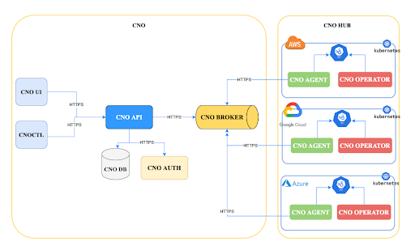

# CNO<br/>Cloud Native Onboarding - DOCUMENTATION

Onboard, Deploy, Manage and Secure microservices on Kubernetes

CNO is an open source platform to onboard easily and securely development teams on multi-cloud Kubernetes clusters from a single console.

*  [Concept](#Concept)
*  [Architecture and System Requirements](#Architecture-and-System-Requirements)
*  [Installation](#Installation)
*  [Configuration](#Configuration)
*  [Tutorials](#Tutorials)

# Concept

*  [CNO - Onboarding](#CNO-Onboarding)
*  [CNO - CD](#CNO-CD)
*  [CNO - HUB](#CNO-HUB)
*  [CNO - Secure](#CNO-Secure)

## **CNO - Onboarding**

The introduction of new technology is not easy in large companies. Sometimes, companies struggle a lot to align the business side especially with adoption of complex technology like Kubernetes.

**CNO** helps you to build the best adoption program that minimizes resistance and **aligns cloud-native technology with Business.**

CNO is designed to be the **best Kubernetes adoption framework** for your entire organization. It effectively combines three key elements; the best onboarding experience for your teams, a reliable and consistent continuous deployment of your applications to market and finally, the involvement of security during onboarding and the continuous deployment of the applications.


## Project and Teams Onboarding

The Onboarding feature is a key element of your Kubernetes adoption process. It will be much easier for the IT Teams to onboard organizational teams and projects within the CNO platform.
From CNO UI, your entire organization can be onboarded into different teams working on specific projects.


* Deploy environments or Kubernetes multicluster namespaces for your applications
* Enforce Multitenancy across your clusters
* Define Resources Requests of a project like CPU, Memory or Storage
* Onboard your organization tenants
* Assign roles to each team member of the project

### **CNO environments or Kubernetes Multi-cluster namespaces**

CNO supports all Kubernetes platforms from a single console like Kubernetes Vanilla, Distributions like Openshift, Tanzu, Rancher, etc.. and all cloud providers Kubernetes services (AKS, EKS and GKE).

In one project, you can define your own environnements, e.g. Dev, Staging, Production or any you want.

CNO brings here an interesting feature called **Multi-cluster namespaces** that allows you to create your environments or namespaces without taking consideration of the underlying cluster ( Edges, On premises or Public Cloud). best For example, you can create a Dev environment on AWS, a Staging environment on OpenShift and a Production environment on Kubernetes Vanilla located in your own datacenter.

  

### **Teams or Organization tenants Onboarding**

During the onboarding phase, you can define several tenants into CNO accordingly to your organization hierarchy. These tenants can represent a group of users that has access to a Project and a subset of cluster resources. Each tenant is composed of a Project Owner and his team's members.

* The project Owner is responsible for a project and the role assignment to specific users.
* Team members of a project can be Administrator, Developer or Viewer.
* Administrators can centralize the management of Kubernetes clusters.
* Developers can set up their environment and deploy their applications without knowing any cloud providers or any Kubernetes platform.
* Viewer' role can be assigned to Auditors that have only read-only permissions.

## Multi Tenancy Enforcement

Kubernetes does not bring by default multitenancy feature. With CNO, you can configure Multitenancy across your different projects and teams.


Several tenants each Project Owner in the company can now create a logical project by specifying exactly the project resources needed in term of:

Environments across multi-cloud Kubernetes Clusters.

The administrators who are maintaining those applications day-to-day

The developers working on the project

  

## Quota Management

Administrators should clearly define quotas for the team in order to control the resources their application can consume.

## Tagging Strategy

introduction

## **CNO - CD**

After aligning Onboarding teams and projects easily, the next challenge is to allow organizations to choose **the fastest way to deliver applications**. **CNO CD** allows you to easily choose the best continuous deployment model that suits your needs. It’s possible to deploy applications manually or automatically. It’s also possible to choose the best advanced deployment model like Canary or Blue/Green or A/B Testing.

## Manual or Automatic Depoy

## Blue/Green

## Canary and A/B testing

Lorem ipsum dolor sit amet consectetur adipisicing elit. Eius dolores tenetur incidunt inventore. Itaque animi, accusantium fuga veritatis ipsam culpa. 

## **CNO - HUB**

To **hide the Kubernetes complexity, CNO Hub** centralizes management, governance and monitoring of all your Kubernetes clusters on any cloud from a single Console.

**CNO Hub gives IT teams the tools to simplify kubernetes technology. In doing so, they can centralise the management of all their Kubernetes clusters from anywhere, from the Cloud or from their own datacenter.**

## Non-managed Clusters

## Cloud Provider managed Clusters

### **Cloud Providers**

### **Managed Clusters**

Lorem ipsum dolor sit amet consectetur adipisicing elit. Eius dolores tenetur incidunt inventore. Itaque animi, accusantium fuga veritatis ipsam culpa.

## **CNO - Secure**

To put security into the entire life cycle of project onboarding and applications development, CNO Secure gives security teams the tools and processes to integrate security without breaking innovation speed.

## IAM

CNO Secure centralizes the management of authentication and authorization of all your users across your cloud providers and Kubernetes clusters.

## Policy

CNO Secure also ensures security policies and compliance by defining and enforcing them on all your Kubernetes clusters on any cloud.

## Scan

Lorem ipsum dolor sit amet consectetur adipisicing elit. Eius dolores tenetur incidunt inventore. Itaque animi, accusantium fuga veritatis ipsam culpa.

  
# Architecture and System Requirements
### [CNO components](#CNO-components)
### [System requirements](#System-requirements)

## **CNO components**



##### CNO is an open source project mainly made up of several components and divided into :
* A control plane
* A Data Plane or CNO HUB
* A Command line interface

#### Control Plane
The control plane includes :
* The CNO UI
* The CNO API
* The CNO Database 
* The CNO IAM
* The CNO Broker
* The CNO Notification

#### CNO API 
The API module is the central component of the platform. It powers the CNO console, as well as the CNO client. The APIs provided are RESTful, HTTP JSON-based, and secured using TLS.

#### CNO UI
CNO provides a user interface to perform onboarding actions for users and manage clusters.

#### CNO Database
CNO uses an SQL database to store the different objects it manages.

#### CNO IAM
There is an IAM module to handle users authentication and management for the CNO platform.

#### CNO Broker
There is an IAM module to handle users authentication and management for the CNO platform.The API and the CNO cluster Agents communicate using a message broker, so that actions can be performed asynchronously.

#### CNO Notification
This module helps handle every notification actions needed on the CNO platform. It provides RESTful, HTTP JSON-based and TLS secured APIs.

#### Dataplane
The data plane has :
* The CNO Agent installed in each kubernetes Cluster
* The CNO Onboarding Operator
* The CNO CD Operator

##### CNO Onboarding Operator
The Onboarding Operator is the controller that handles the lifecycle of the CNO Custom Resources on the managed Cluster.

##### CNO CD Operator 
CNO offers Continuous Deployment operations for users through the CD Operator. This operator handles the Custom Resources related to the CD actions provided by CNO.

##### CNO Agent
CNO offers Continuous Deployment operations for users through the CD Operator. This operator handles the Custom Resources related to the CD actions provided by CNO.

### Command Line Interface
##### CNO CLI (cnoctl)

## **System requirements**
#### Supported Kubernetes Version
CNO is an open source project mainly made up of several components and divided into:
#### Minimal Sizing
* CNO
                  -  4GB or more of RAM
                  - 2CPUs or more
* Data Plane :
			      - 100MB
			      - 100m CPU  
#### Network Considerations
Depending on the installation type, CNO uses service types NodePort or LoadBalancer or Ingress to expose the User Interface.
#### Disconnected installation
Depending on the installation type, CNO uses service types NodePort or LoadBalancer or Ingress to expose the User Interface.
* Pulling CNO images
* Getting CNO Manifests
#### Pulling CNO images :
The images to pull for cno install:

``` code
#Setting registry images

KEYCLOAK_OPERATOR_IMAGE=  "quay.io/keycloak/keycloak-operator:12.0.1"

KEYCLOAK_IMAGE=  "quay.io/keycloak/keycloak:12.0.1"

KEYCLOAK_POSTGRESQL_IMAGE=  "registry.access.redhat.com/rhscl/postgresql-10-rhel7:1"

KAFKA_OPERATOR_IMAGE=  "strimzi/operator:0.20.0"

KAFKA_TOPIC_OPERATOR_IMAGE=  "strimzi/operator:0.20.0"

KAFKA_USER_OPERATOR_IMAGE=  "strimzi/operator:0.20.0"

KAFKA_TLS_SIDECAR_ENTITY_OPERATOR_IMAGE=  "strimzi/kafka:0.20.0-kafka-2.5.0"

KAFKA_BROKER_IMAGE=  "strimzi/kafka:0.20.0-kafka-2.5.0"

KAFKA_ZOOKEEPER_IMAGE=  "strimzi/kafka:0.20.0-kafka-2.5.0"

MYSQL_OPERATOR_ORCHESTRATOR_IMAGE=  "quay.io/presslabs/mysql-operator-orchestrator:0.4.0"

MYSQL_IMAGE=  "percona@sha256:713c1817615b333b17d0fbd252b0ccc53c48a665d4cfcb42178167435a957322"

MYSQL_SIDECAR_IMAGE=  "quay.io/presslabs/mysql-operator-sidecar:0.4.0"

MYSQL_EXPORTER_IMAGE=  "prom/mysqld-exporter:v0.11.0"

CNO_API_IMAGE=  "beopenit/cno-api:latest"

CNO_NOTIFICATION_IMAGE=  "beopenit/cno-notification:v0.0.1-alpha"

CNO_UI_IMAGE=  "beopenit/cno-ui:latest"
```
These images must be pushed in a private registry for cno to be able to used them.

#### Getting CNO Manifests:
Clone the cno repository:
``` code
$ git clone https://github.com/beopencloud/cno.git
```
The repository must be put in a private git server.

#### Editing scripts
To perform the installation, edit the following scripts, depending on the exposition type:  
`_cno -> scripts -> control-plane -> install*.sh_`  
`_cno -> scripts -> data-plane -> install*.sh_`

The set the new private RAW git repo for the files to be downloaded, as shown in the following example:

``` code
CNO_RAW_REPOSITORY=  "https://raw.githubusercontent.com/beopencloud/cno" 
```

Then set the new image urls, as shown in the previous paragraph.
# Installation

## **Install CNOCTL**

The CLI can be installed with a curl script, brew or by downloading the binary from the releases page. Once installed you'll get the cnoctl command.

## Install with curl:

```
$ curl -sSL https://raw.githubusercontent.com/beopencloud/cno/main/scripts/cnoctl.sh | sh
```

## Install with brew on MacOs:

```
$ brew tap beopencloud/cno
```

```
$ brew install cnoctl
```

## Install from release:

In the cnoctl release page (https://github.com/beopencloud/cno/releases) download, unarchive the version needed and move the binary to your system PATH.

Example for version v0.0.1 on MacOs:

```
$ wget https://github.com/beopencloud/cno/releases/download/v0.0.1/cnoctl_0.0.1_Darwin_x86_64.tar.gz
```
```
$ tar -xzf cnoctl_0.0.1_Darwin_x86_64.tar.gz
```

```
$ mv cnoctl /usr/local/bin/
```

## Verify cnoctl installation

Check that cnoctl is properly installed by getting the command help:

Example for version v0.0.1 on MacOs:

```
$ cnoctl --help
```

## **Quick Installation CNO with CNOCTL**

To install CNO you need Kubernetes v1.16 or higher.
Once cnoctl is installed, to install CNO run the following command:
```
$ cnoctl init --type aks --domain cno-dev.beopenit.com --ingress-type nginx
```
The supported flags are:
* --domain: The wirldcard domain configured in the cluster
* --ingress-type: The ingress type used in the cluster: nodeport, nginx, router, loadbalancer
* --namespace: cno install namespace (default "cno-system")
* --type: The kubernetes in which cno is been install type: vanilla, aks, eks, gke (default "vanilla")
* --version: cno version to install (default "1.0.0-rc")
* --with-dataplane: install cno with a default dataplane (default true)

# Configuration

*  [Defining Tagging Strategy](#Defining-Tagging-Strategy)
*  [QUOTA Management for your Organization](#QUOTA-Management-for-your-Organization)
*  [Adding Cloud Providers](#Adding-Cloud-Providers)
*  [LDAP Configuration](#LDAP-Configuration)
*  [Configure Messaging](#Configure-Messaging)  

## **Defining Tagging Strategy**

Tags are elements made up of pairs (key and values) whose main purpose is to allow the identification of resources or clusters. They are defined by the user and must be relevant and specific in order to facilitate the identification of the resources to which they will be assigned.

## CREATION SYNTAX

Create a tag by giving elements of configuration
```
cnoctl adm create tag [name] [--flags]
```

The supported arguments are:
* name: The name of the tag you want to create | [REQUIRED]

The supported flags are:

* type: The type of flag text or selection | [REQUIRED]
* text type: a simple text field to assign a value to the tag
* selection type: a selection field to assign a value to the tag
* value: the value of type selection value1,value2 | [OPTIONAL]
* required : use it if our tag is required | [OPTIONAL]

## GET SYNTAX

List informations about all tag
```
cnoctl adm get tag [tag_id]
```

The supported arguments are:

* tag_id: The id of the tag from which we want to retrieve information. To specify if you want to get information about a specific tag | [OPTIONAL]

## **QUOTA Management for your Organization**

  

It is the different capacities allocated to a cluster that allow it to function properly. The different capacities are the cpu, the limit and the storage.
* The cpu is the value of the processor allocated to a cluster, it takes into account 2 parameters, the limit value (maximum value that can be allocated to a cluster) and the request value (the minimum value that a cluster needs to function). It is measured in Core or Mcore
* The limit is the value of the memory allocated to a cluster. Like the cpu, it takes into account a limit value and a request value. However it is measured in M,Mi,G,Gi
* The storage, that is the capacity that a cluster can have, is also measured in M,Mi,G,Gi

## CREATION SYNTAX

Create a quota by giving elements of configuration
```
cnoctl adm create quota [name] --cpu LimitValue,RequestValue --memory LimitValue,RequestValue --storage valueStorage
```

The supported arguments are:

* name: The name of the quota you want to create | [REQUIRED]

The supported flag are:

* __cpu__:  cpu parameter limit value and request, which are separated by comma. | [REQUIRED]
* __memory__: memory parameter limit value and request, which are separated by comma. | [REQUIRED]
* __storage__: storage value | [REQUIRED]
* it is not possible to put a request value, it will be deducted from the limit value

## GET

List informations about all quota

```
cnoctl adm get quota [name]
```

The supported arguments are:

* name: The name of the quota from which we want to retrieve information. To specify if you want to get information about a specific quota | [OPTIONAL]

  

## **Adding Cloud Providers**

Several cloud providers are supported by CNO. We use cloud providers in CNO to get Kubernetes clusters that we want to manage through CNO. Available cloud providers in CNO are AWS, Azure and Google Cloud.

Since they are different, each of them will have its own configuration.

  

## CREATION SYNTAX

Create a tag by giving elements of configuration

### **AWS**

```
cnoctl adm create provider-eks [name] [--flags]
```

The supported arguments are:

* name: The name of the cloud provider you want to create | [REQUIRED]

The supported flags are:

* default-region: The region of the provider | [REQUIRED]
* access-key: Access key for Aws cloud provider | [REQUIRED]
* secret-key: Secret key for Aws cloud provider | [REQUIRED]
* session-token: Session Token for Aws cloud provider | [REQUIRED]

###  **AZURE**

```
cnoctl adm create provider-aks [name] [--flags]
```

The supported arguments are:

* name: The name of the cloud provider you want to create | [REQUIRED]

The supported flags are:

* client-id: The client-id for aks provider | [REQUIRED]
* client-secret: The client secret for aks provider | [REQUIRED]
* subscription-id: The subscription id for aks provider | [REQUIRED]
* tenant-id: The tenant id of the aks provider | [REQUIRED]

### **GCP**

```
cnoctl adm create provider-gke [name] [--flags
```

The supported arguments are:

* name: The name of the cloud provider you want to create | [REQUIRED]

The supported flags are:

* Json-file: The json file that contains the configuration of the gke provider | [REQUIRED]

## GET SYNTAX

List informations about all cloud provider

```
cnoctl adm get provider [name]
```

The supported arguments are:

* name: The name of the cloud provider from which we want to retrieve information. To specify if you want to get information about a specific provider | [OPTIONAL]

## **LDAP Configuration**

## Configure Ldap Account

Ldap Account consists of creating an Ldap Server to store and use users, group.

Creating ldap account by giving the following command

```
cnoctl adm create ldap [--flags ]
```

The supported flags are:

* url: The url of your ldap account | [REQUIRED]
* port: The port of the ldap account (389 for ldap, 634 for ldaps) | [REQUIRED]
* cn: The common name of the ldap server | [REQUIRED]
* basedn: The base domain name | [REQUIRED]
* admin-password: define the ldap admin password | [REQUIRED]

## Get LDAP Account

List informations about your Ldap Account

```
cnoctl adm get ldap
```

  

## **Configure Messaging**

Messaging Account consists of creating an SMTP server to send emails or notifications to CNO users.
Create a messaging account by giving elements of configuration

```
cnoctl adm create smtp [--flags]
```

The supported flags are:

* email: The sender email of your organization | [REQUIRED]
* smtp-password: The sender email account password | [REQUIRED]
* smtp-server: The name of the most common email providers' servers | [REQUIRED]
* smtp-port: The port of the email provider's servers | [REQUIRED]


## GET SYNTAX

List informations about Your Messaging Account

```
cnoctl adm get smtp
```

## TEST SYNTAX

Do a test to make sure that the smtp server configuration is correct

```
cnoctl adm test smtp receivermail@mail.com -m "Your message"
or
cnoctl adm test smtp receivermail@mail.com --message "Your message"
```

The supported flags are:

* email or e: the receiver mail test | [REQUIRED]
* message or m: the message to sent| [OPTIONAL]

 
# Tutorials
* [Multi Cloud Management with CNO Hub](https://viktormoskalev07.github.io/cno/dist/gs-multi-cloud(tutorials).html)
* [IAM Set Up](https://viktormoskalev07.github.io/cno/dist/gs-iam-setup(tutorials).html)
* [Onboard projects and teams](https://viktormoskalev07.github.io/cno/dist/gs-onboard-projects(tutorials).html)
* [Continuous Deployment](https://viktormoskalev07.github.io/cno/dist/gs-contin-deploy(tutorials).html)