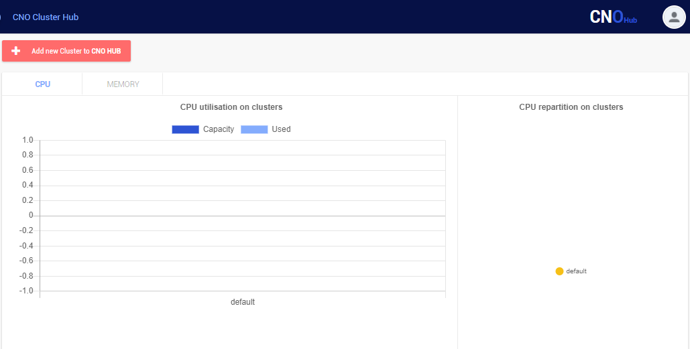
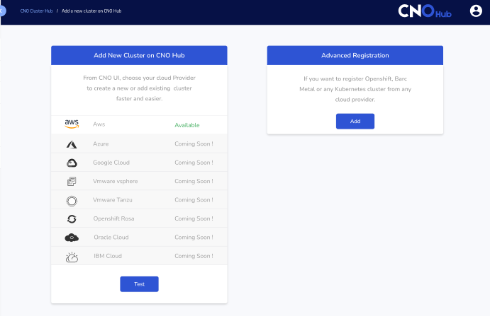
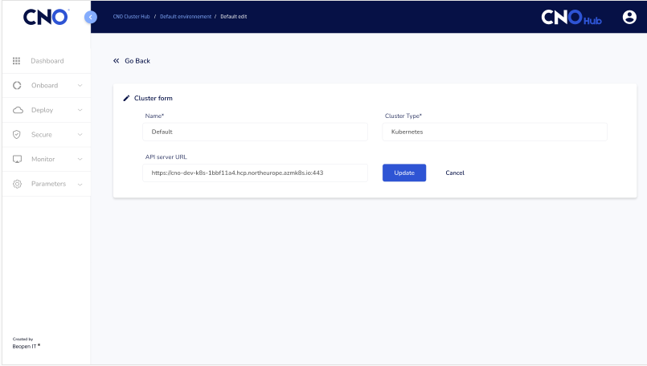

# Description for use cluster features in CNO

## I. Register an existing cluster

1. Platform supported 

    - Amazon Elastic Kubernetes Service (EKS)
    - Google Kubernetes Engine (GKE)
    - Azure Kubernetes Service (AKS)
    - RedHat Hat OpenShift Container Platform
    - VMware Tanzu
    - Rancher
    - Scaleway Kubernetes Kapsule
    - Any other kubernetes distribution

2. Step to register an existing cluster

To access the CNO HUB you have to follow [CNO UI](https://cno.cno-dev.beopenit.com/). Once on the CNO interface, you must click on ``` CNOHub ``` at the top right on the dashboard to access the registration space of an existing cluster. After this we can see other interface, at the top left click on 
``` 
Add new Cluster to CNOHub 
```


When you finish to click on this target we can see a other interface in wich there two fields. For register an existing cluster you must click on ` Advanced Registration `.



After this picture you can see the interface which permit to you to register your cluster form.But you must to have your cluster before this step.



On this interface you can put the name of your cluster, his Api server URL and the cluster type. All the fields are required. If you finish to inform these field you can click on ` Add `.

After clicking on ` Add ` a new window opens so that we can add the CNO agent to the cluster created.


## II. Creating a Cluster form
