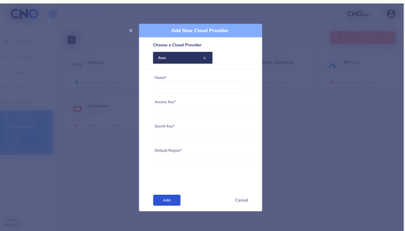

# Description for the use of cluster features in CNO

## I. Register an existing cluster

1. Platforms supported: 

    - Amazon Elastic Kubernetes Service (EKS)
    - Google Kubernetes Engine (GKE)
    - Azure Kubernetes Service (AKS)
    - RedHat Hat OpenShift Container Platform
    - VMware Tanzu
    - Rancher
    - Scaleway Kubernetes Kapsule
    - Any other Kubernetes distribution

2. Step to register an existing cluster

You can follow [CNO UI](https://cno.cno-dev.beopenit.com/) indications to access CNO HUB.
Once on the CNO interface, you must click on "CNOHub" at the top right of the dashboard to access the registration space of an existing cluster. 
After this, you will see another interface. At the top left of it, click on: "Add a new Cluster to CNOHub."

After the click, you will see another interface with two fields. You must click on "Advanced Registration" to register an existing cluster.

You can see the interface that permits you to register your cluster in the part cluster form. But you must have your cluster before this step.

On this interface, put the name of your cluster, its Api server URL, and the cluster type. All the fields are required. When you are done, click on "Add."

After clicking on "Add,"  a new window opens. Copy the output commands to install the CNO agent to the cluster created.

## II. Creating a Cluster from CNO Hub

1. Platform supported

The creation of a cluster only supports the AWS EKS platform.

2. Register an existing Cluster

On CNO Hub, click on "Add a New cluster to CNO Hub:"

Click on the button **Test** to access the interface to see existing clusters with their cloud providers.

Two buttons are displayed at the top right:
"Add an existing cluster."
"Add a new cluster."

### Add existing cluster

For this part, use the button "Add an existing cluster."

Then, select the cloud provider available :

After selection, two options are highlighted. Click on *Add an existing cluster*, and this interface appears :

On this interface, you must choose a cloud provider. Then, select the cluster existing on this cloud provider and click on "Add."?

### Add new cluster

To create a new cluster and register it to CNO Hub, click on the button "Add a new Cluster:"

**Halt** When you click on "add a new cluster," you are asked to choose a cloud provider. However, you must have added a cloud provider before choosing a cloud. 

You can see how to add a cloud provider in the last part.

## III. Add cloud providers

1. Platform supported

For now, CNO only supports the AWS EKS platform.

2. Add your cloud provider

To add a cloud provider, go to the left menu in the parameters section. Click on "parameters" and then on "cloud provider."

On the interface that appeared, click on *Add a New Cloud Provider*at the top right. 
You will arrive at a new interface:

Only AWS is available at the moment. 
Fill in the rest of the required fields to validate by pressing the add button.
